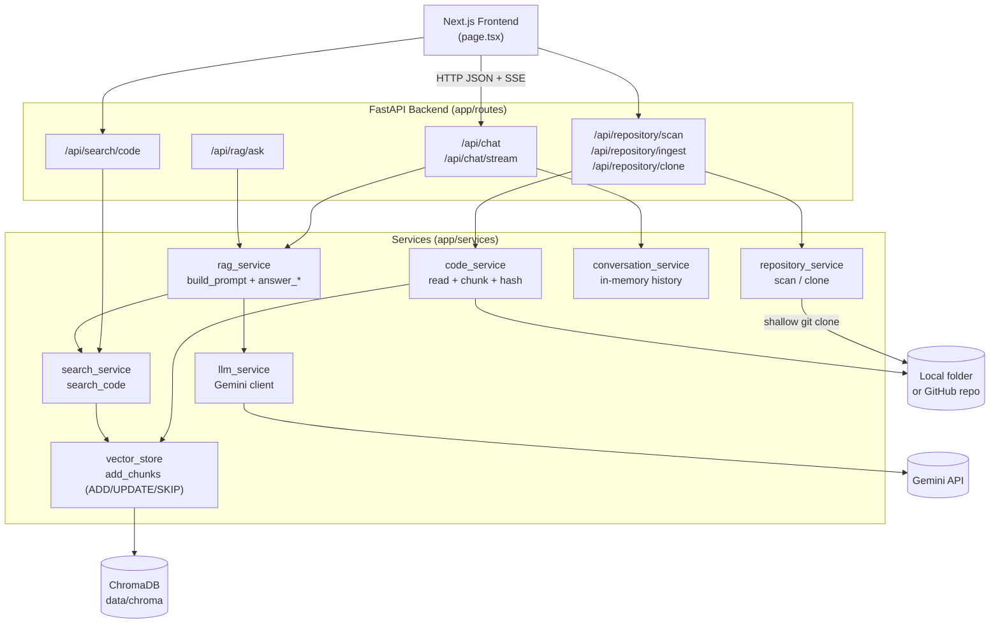
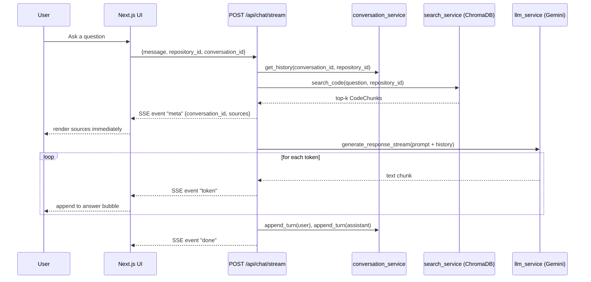
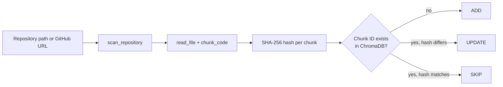

# AI Engineering Copilot

A repository-aware AI developer assistant. Point it at a local folder or a
GitHub URL, and it ingests the codebase, builds a searchable vector index,
and answers questions about it — grounded in the actual source, with
file/line citations and streamed, multi-turn responses.

Backend: **FastAPI** (Python) · Frontend: **Next.js 16 / React 19**
Vector store: **ChromaDB** · Embeddings: **sentence-transformers** (local,
`all-MiniLM-L6-v2`) · LLM: **Google Gemini**

---

## Table of Contents

- [Features](#features)
- [Architecture](#architecture)
- [Project Structure](#project-structure)
- [Tech Stack](#tech-stack)
- [Getting Started](#getting-started)
- [API Reference](#api-reference)
- [Core Concepts](#core-concepts)
- [Known Limitations](#known-limitations)
- [Roadmap](#roadmap)

---

## Features

**Repository ingestion**
- Ingest from a **local filesystem path** or a **GitHub URL** (shallow-cloned
  server-side, then treated identically to a local repo).
- Recursive scan with an extension allow-list (`.py .js .jsx .ts .tsx .java
  .cpp .c .cs .go .rs .html .css .json .md`) and ignored directories (`.git`,
  `node_modules`, `venv`, `__pycache__`, `.next`, `dist`, `build`).
- Language detection by file extension.
- Fixed-size line-based chunking (50 lines/chunk) with a SHA-256 content
  hash per chunk.
- Deterministic `repository_id` (SHA-256 of the path/URL, truncated to 12
  chars) — many repositories can live in one vector store, fully isolated
  from one another.
- **Incremental sync on re-ingest**: unchanged chunks are `SKIP`ped, changed
  chunks are `UPDATE`d, new chunks are `ADD`ed — keyed by `repository_id +
  file_path + start_line`, compared by content hash. *(Chunks for files
  deleted from the repo since the last ingest are **not** currently pruned —
  see [Known Limitations](#known-limitations).)*

**Semantic search**
- ChromaDB-backed vector search over ingested chunks, filtered by
  `repository_id` so repositories never leak into each other's results.

**RAG-powered chat**
- Retrieval → context builder → prompt construction → Gemini generation.
- **Source attribution**: every answer comes with the file path, language,
  line range, and match score of the chunks that grounded it.
- **Multi-turn conversation history**: a `conversation_id` scopes chat turns
  per repository, so follow-ups like *"which file defines **that** model?"*
  resolve correctly. History is capped at the last 10 turns per
  conversation.
- **Streaming responses** over Server-Sent Events — sources arrive
  immediately, then the answer streams token-by-token.

**Frontend**
- Three-panel layout: repository/file explorer, chat, sources.
- Local-path or GitHub-URL repository loader with live status.
- Collapsible file tree, streamed chat bubbles with an animated "thinking"
  indicator, "New Chat" reset, dark/light theme-aware design system.

---

## Architecture

### System overview



### Streaming chat sequence



### Incremental ingestion sync



---

## Project Structure

```text
AI-Engineering-Copilot/
├── backend/
│   ├── app/
│   │   ├── main.py                    # FastAPI app, CORS, router registration
│   │   ├── models/
│   │   │   ├── chat.py                # ChatRequest, ChatResponse, SourceReference
│   │   │   └── code.py                # CodeChunk
│   │   ├── routes/
│   │   │   ├── chat.py                # POST /api/chat, POST /api/chat/stream, DELETE /api/chat/{id}
│   │   │   ├── repository.py          # GET /api/repository/scan, POST /clone
│   │   │   ├── ingestion.py           # POST /api/repository/ingest
│   │   │   ├── search.py              # GET /api/search/code
│   │   │   └── rag.py                 # GET /api/rag/ask
│   │   └── services/
│   │       ├── repository_service.py  # scan_repository, clone_github_repository
│   │       ├── code_service.py        # read_file, chunk_code, get_language
│   │       ├── vector_store.py        # ChromaDB client, add_chunks (ADD/UPDATE/SKIP)
│   │       ├── search_service.py      # search_code
│   │       ├── rag_service.py         # build_prompt, answer_repository_question(_stream)
│   │       ├── conversation_service.py# per-repository chat history (in-memory)
│   │       └── llm_service.py         # Gemini client, generate_response(_stream)
│   ├── data/chroma/                   # persistent ChromaDB store (gitignored)
│   ├── requirements.txt
│   └── .env                           # GEMINI_API_KEY (gitignored)
│
└── frontend/
    ├── app/
    │   ├── layout.tsx                 # root layout, fonts, page metadata
    │   ├── page.tsx                   # entire UI: repo loader, chat, sources
    │   └── globals.css                # design tokens, light/dark theme
    ├── next.config.ts
    └── package.json
```

---

## Tech Stack

| Layer | Technology |
| --- | --- |
| Backend framework | FastAPI + Uvicorn |
| Backend language | Python 3.10+ |
| Data validation | Pydantic |
| Vector database | ChromaDB (persistent, local disk) |
| Embeddings | sentence-transformers (`all-MiniLM-L6-v2`, local, no external API) |
| LLM | Google Gemini (`google-genai` SDK) — `gemini-3.6-flash` |
| Frontend framework | Next.js 16 (App Router, Turbopack) |
| UI library | React 19 |
| Styling | Tailwind CSS v4 (custom design tokens, dark/light aware) |
| Repository access | Git CLI (shallow clone for GitHub URLs) |

---

## Getting Started

### Backend

```bash
cd backend
python -m venv venv
venv\Scripts\activate          # Windows; use `source venv/bin/activate` on macOS/Linux
pip install -r requirements.txt
```

Create `backend/.env`:

```env
GEMINI_API_KEY=your_gemini_api_key
```

> `requirements.txt` may not fully capture every runtime dependency (e.g.
> `chromadb`, `sentence-transformers`) depending on when it was last
> regenerated. If `uvicorn` fails to import something, `pip install` the
> missing package and re-freeze with `pip freeze > requirements.txt`.

Run the API:

```bash
uvicorn app.main:app --reload
```

Backend is now live at `http://127.0.0.1:8000` (interactive docs at `/docs`).

### Frontend

```bash
cd frontend
npm install
npm run dev
```

Frontend is now live at `http://localhost:3000`.

### Try it end-to-end

1. Open the app, pick **Local Path** or **GitHub**, and load a repository.
2. Ask a question in the chat box — the answer streams in with cited
   sources on the right.
3. Ask a follow-up using a pronoun ("that file", "it") — conversation
   history resolves the reference.
4. Click **New Chat** to reset the conversation without reloading the
   repository.

---

## API Reference

All routes are mounted with an `/api` prefix except the two health routes.

| Method | Path | Purpose |
| --- | --- | --- |
| `GET` | `/` | Liveness message |
| `GET` | `/health` | Health check |
| `GET` | `/api/repository/scan` | List files in a local path (no indexing) |
| `POST` | `/api/repository/clone` | Shallow-clone a GitHub repo, return its local path |
| `POST` | `/api/repository/ingest` | Scan + chunk + embed + sync a repo into ChromaDB |
| `GET` | `/api/search/code` | Raw semantic search over an ingested repo (no LLM) |
| `GET` | `/api/rag/ask` | One-shot RAG question/answer (non-streaming) |
| `POST` | `/api/chat` | RAG chat with conversation history (non-streaming) |
| `POST` | `/api/chat/stream` | Same as above, streamed via Server-Sent Events |
| `DELETE` | `/api/chat/{conversation_id}` | Clear a conversation's stored history |

### `GET /api/repository/scan`

```
GET /api/repository/scan?repository_path=C:\path\to\repo
```
```json
{ "repository": "...", "file_count": 15, "files": ["app/main.py", "..."] }
```

### `POST /api/repository/clone`

```
POST /api/repository/clone?repository_url=https://github.com/owner/repo
```
Accepts only `https://github.com/<owner>/<repo>` URLs (validated by regex,
plus a `--` argument-separator when invoking `git clone`, to block both
non-GitHub hosts and flag-injection payloads). Returns:
```json
{ "repository_url": "...", "repository_path": "C:\\...\\ai-copilot-repos\\<hash>" }
```

### `POST /api/repository/ingest`

```
POST /api/repository/ingest?repository_path=C:\path\to\repo
```
```json
{
  "repository": "...", "repository_id": "a28a00dec879",
  "file_count": 16, "chunk_count": 25,
  "ingestion": { "added": 0, "updated": 0, "skipped": 25 }
}
```

### `GET /api/search/code`

```
GET /api/search/code?query=how is auth handled&repository_id=a28a00dec879&limit=5
```
Returns a list of `CodeChunk` objects (file path, language, line range,
content, ChromaDB distance as `score` — **lower is a closer match**).

### `POST /api/chat` / `POST /api/chat/stream`

Request body (both endpoints):
```json
{
  "message": "How is the chat endpoint implemented?",
  "repository_id": "a28a00dec879",
  "conversation_id": null
}
```
`conversation_id` is optional — omit it to start a new conversation; the
response always includes the id to reuse on the next turn.

`/api/chat` responds with:
```json
{
  "message": "...",
  "conversation_id": "26cbde98-...",
  "sources": [
    { "file_path": "app/routes/chat.py", "language": "python",
      "start_line": 1, "end_line": 27, "score": 0.659 }
  ]
}
```

`/api/chat/stream` responds with `text/event-stream`, three event types:
```
event: meta
data: {"conversation_id": "...", "sources": [...]}

event: token
data: <chunk of answer text>

event: done
data: {}
```
Multi-line token chunks are framed per the SSE spec (one `data:` line per
line of text within a single event), so the client reconstructs internal
newlines by joining `data:` lines rather than treating every `data:` line
as a separate token.

---

## Core Concepts

**Why chunking + hashing.** Sending an entire repository to an LLM is
neither cheap nor accurate. Splitting files into fixed-size chunks and
hashing each one means re-ingesting a repo only touches what actually
changed — unchanged files cost nothing on repeat ingestion.

**Why `repository_id`.** ChromaDB stores every ingested repository's chunks
in a single collection. Every query filters by `repository_id`, so two
repositories with a file of the same name never bleed into each other's
search results — this is what lets the frontend hold multiple repos over
time without cross-contamination.

**RAG pipeline.** `rag_service.answer_repository_question[_stream]` ties the
whole system together: `search_service.search_code()` retrieves the top-k
chunks for the question, `build_context()` formats them with file/line
metadata, `build_history_block()` folds in prior conversation turns, and
the assembled prompt goes to Gemini. The non-streaming and streaming
variants share the same retrieval and prompt-building code — they only
differ in whether `llm_service.generate_response` or
`generate_response_stream` is called.

**Conversation history.** `conversation_service` keeps an in-memory map of
`conversation_id → (repository_id, turns)`. If a request's `repository_id`
doesn't match what a conversation was created with, its history is
silently reset rather than leaking context from the wrong repo. History is
capped at the last 10 turns to bound prompt size.

---

## Known Limitations

- **Conversation history is in-memory only** — it resets on backend
  restart and isn't safe under heavy concurrent access. Fine for local,
  single-user use; would need a real store (Redis/SQLite/etc.) otherwise.
- **No delete-sync on ingestion** — if a file is removed from the
  repository between ingests, its previously indexed chunks stay in
  ChromaDB. Only `ADD` / `UPDATE` / `SKIP` are implemented, not a
  removal pass.
- **No authentication** — the API is open, intended for local development.
- **Chat responses render as plain text** — the model sometimes returns
  Markdown (`### `, `**bold**`) which currently shows as literal characters
  in the chat bubble rather than being rendered.
- **`requirements.txt` may be incomplete** relative to actual imports
  (e.g. `chromadb`, `sentence-transformers`); regenerate it periodically
  with `pip freeze`.

---

## Roadmap

**Done:** local + GitHub ingestion, scanning, chunking, hashing, ADD/UPDATE/SKIP
sync, ChromaDB vector search, RAG-connected chat, source attribution,
multi-turn conversation history, SSE streaming, redesigned 3-panel UI.

**Next:**
- Delete-sync for files removed from a repository
- Persistent conversation store
- Markdown rendering in the chat UI
- Repository/file-scoped chat (narrow retrieval to a chosen file or folder)
- Code explanation workflow
- Debugging workflow
- AI tool calling
- Automated tests
