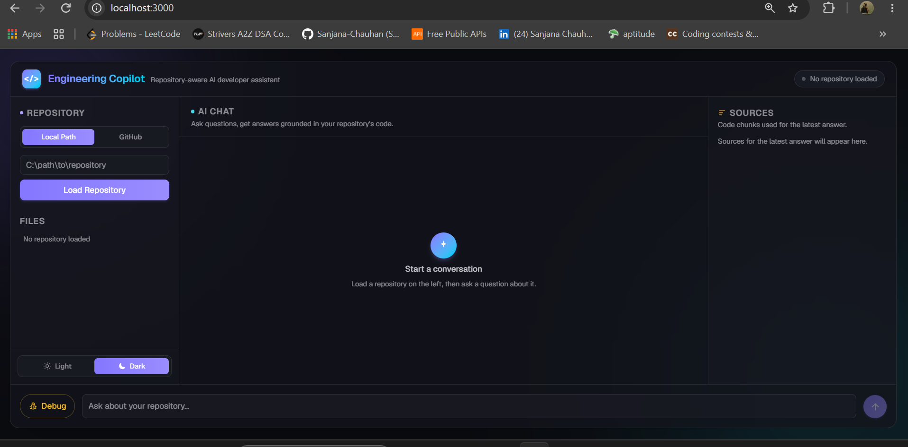
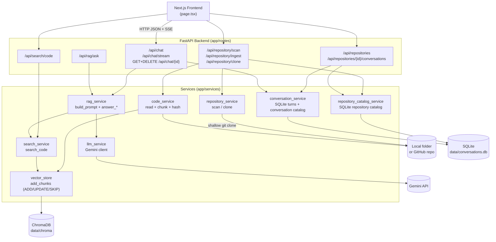
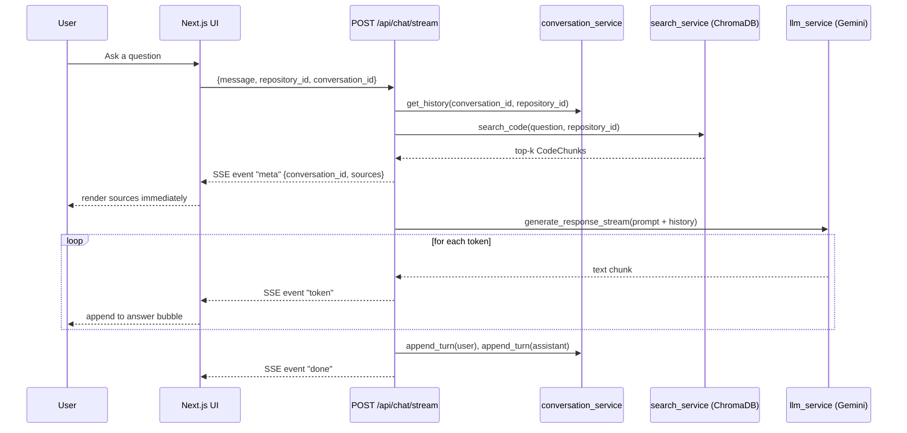
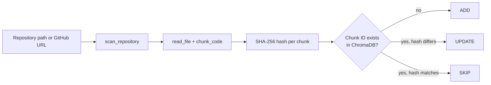

# AI Engineering Copilot

A repository-aware AI developer assistant. Point it at a local folder or a
GitHub URL, and it ingests the codebase, builds a searchable vector index,
and answers questions about it — grounded in the actual source, with
file/line citations and streamed, multi-turn responses.

Backend: **FastAPI** (Python) · Frontend: **Next.js 16 / React 19**
Vector store: **ChromaDB** · Embeddings: **sentence-transformers** (local,
`all-MiniLM-L6-v2`) · LLM: **Google Gemini**

---

## Table of Contents

- [Features](#features)
- [Architecture](#architecture)
- [Project Structure](#project-structure)
- [Tech Stack](#tech-stack)
- [Getting Started](#getting-started)
- [API Reference](#api-reference)
- [Core Concepts](#core-concepts)
- [Known Limitations](#known-limitations)
- [Roadmap](#roadmap)

---`

## Features

**Repository ingestion**
- Ingest from a **local filesystem path** or a **GitHub URL** (shallow-cloned
  server-side, then treated identically to a local repo).
- Recursive scan with an extension allow-list (`.py .js .jsx .ts .tsx .java
  .cpp .c .cs .go .rs .html .css .json .md`) and ignored directories (`.git`,
  `node_modules`, `venv`, `__pycache__`, `.next`, `dist`, `build`).
- Language detection by file extension.
- Fixed-size line-based chunking (50 lines/chunk) with a SHA-256 content
  hash per chunk.
- Deterministic `repository_id` (SHA-256 of the path/URL, truncated to 12
  chars) — many repositories can live in one vector store, fully isolated
  from one another.
- **Incremental sync on re-ingest**: unchanged chunks are `SKIP`ped, changed
  chunks are `UPDATE`d, new chunks are `ADD`ed — keyed by `repository_id +
  file_path + start_line`, compared by content hash. *(Chunks for files
  deleted from the repo since the last ingest are **not** currently pruned —
  see [Known Limitations](#known-limitations).)*

**Semantic search**
- ChromaDB-backed vector search over ingested chunks, filtered by
  `repository_id` so repositories never leak into each other's results.

**RAG-powered chat**
- Retrieval → context builder → prompt construction → Gemini generation.
- **Source attribution**: every answer comes with the file path, language,
  line range, and match score of the chunks that grounded it.
- **Multi-turn conversation history**: a `conversation_id` scopes chat turns
  per repository, so follow-ups like *"which file defines **that** model?"*
  resolve correctly. History is capped at the last 10 turns per
  conversation.
- **Streaming responses** over Server-Sent Events — sources arrive
  immediately, then the answer streams token-by-token.

**Frontend**
- VS Code/ChatGPT-style layout: a narrow **activity bar** (Files / Chats /
  Repositories icons) plus a content panel that shows only the active tab,
  next to the chat pane and the sources panel — new functionality is a new
  icon + panel, not a redesign of an ever-growing single sidebar.
- Local-path or GitHub-URL repository loader with live status (lives in the
  Repositories tab).
- Collapsible file tree, streamed chat bubbles with a progressive
  Claude-style status line ("Reading main.py…") that shows only the current
  step, "New Chat" reset, dark/light theme-aware design system.
 

**Persistent, browsable history — but never auto-loaded**
- Opening or refreshing the app always starts blank; nothing loads until
  you explicitly pick a repository. A repository is only ever ingested/
  loaded in response to a direct action (Load Repository, or picking one
  from the Repositories tab) — never silently, on mount or otherwise.
- A **repository catalog** (SQLite) tracks every repository ever ingested —
  the activity bar's **Repositories** tab lists them and lets you switch
  with a click (the header badge jumps straight there).
- A **conversation catalog** (SQLite) tracks every conversation per
  repository, auto-titled from its first message — the activity bar's
  **Chats** tab lets you reopen any past conversation for the loaded
  repository.

---



## Architecture

### System overview`



### Streaming chat sequence



### Incremental ingestion sync



---

## Project Structure

```text
AI-Engineering-Copilot/
├── backend/
│   ├── app/
│   │   ├── main.py                    # FastAPI app, CORS, router registration
│   │   ├── config.py                  # all env-driven settings (URLs, model, paths)
│   │   ├── models/
│   │   │   ├── chat.py                # ChatRequest, ChatResponse, SourceReference
│   │   │   └── code.py                # CodeChunk
│   │   ├── routes/
│   │   │   ├── chat.py                # POST/GET /api/chat, POST /api/chat/stream, DELETE /api/chat/{id}
│   │   │   ├── repository.py          # GET /api/repository/scan, POST /clone, GET /api/repositories(+/{id}/conversations)
│   │   │   ├── ingestion.py           # POST /api/repository/ingest
│   │   │   ├── search.py              # GET /api/search/code
│   │   │   └── rag.py                 # GET /api/rag/ask
│   │   └── services/
│   │       ├── db.py                  # shared SQLite connection helper (data/conversations.db)
│   │       ├── repository_service.py  # scan_repository, clone_github_repository
│   │       ├── repository_catalog_service.py # repository catalog: upsert_repository, list_repositories
│   │       ├── code_service.py        # read_file, chunk_code, get_language
│   │       ├── vector_store.py        # ChromaDB client, add_chunks (ADD/UPDATE/SKIP)
│   │       ├── search_service.py      # search_code
│   │       ├── rag_service.py         # build_prompt, answer_repository_question(_stream)
│   │       ├── tool_service.py        # tool declarations + executor for AI tool calling
│   │       ├── conversation_service.py# chat history + conversation catalog (SQLite-backed)
│   │       └── llm_service.py         # Gemini client, generate_response(_stream), generate_with_tools(_stream)
│   ├── data/chroma/                   # persistent ChromaDB store (gitignored)
│   ├── data/conversations.db          # persistent conversation history (gitignored)
│   ├── requirements.txt
│   ├── .env.example                   # documents all available env vars
│   └── .env                           # GEMINI_API_KEY + overrides (gitignored)
│
└── frontend/
    ├── app/
    │   ├── layout.tsx                 # root layout, fonts, page metadata
    │   ├── page.tsx                   # entire UI: repo loader, chat, sources
    ├── .env.example                   # documents NEXT_PUBLIC_API_BASE_URL
    ├── .env.local                     # local override (gitignored)
    │   └── globals.css                # design tokens, light/dark theme
    ├── next.config.ts
    └── package.json
```

---

## Tech Stack

| Layer | Technology |
| --- | --- |
| Backend framework | FastAPI + Uvicorn |
| Backend language | Python 3.10+ |
| Data validation | Pydantic |
| Vector database | ChromaDB (persistent, local disk) |
| Embeddings | sentence-transformers (`all-MiniLM-L6-v2`, local, no external API) |
| LLM | Google Gemini (`google-genai` SDK) — `gemini-3.6-flash` |
| Frontend framework | Next.js 16 (App Router, Turbopack) |
| UI library | React 19 |
| Styling | Tailwind CSS v4 (custom design tokens, dark/light aware) |
| Markdown rendering | `react-markdown` + `remark-gfm` |
| Conversation storage | SQLite (`sqlite3`, stdlib — no extra dependency) |
| Repository access | Git CLI (shallow clone for GitHub URLs) |
| Code chunking | `tree-sitter` + `tree-sitter-language-pack` (AST-aware for Python/JS/TS; fixed-line fallback elsewhere) |
| Keyword search | `rank-bm25` (BM25Okapi, in-memory per query), fused with vector search via Reciprocal Rank Fusion |

---

## Getting Started

### Backend

```bash
cd backend
python -m venv venv
venv\Scripts\activate          # Windows; use `source venv/bin/activate` on macOS/Linux
pip install -r requirements.txt
```

Copy `backend/.env.example` to `backend/.env` and fill in your key:

```env
GEMINI_API_KEY=your_gemini_api_key
```

`.env.example` also documents optional overrides (`ALLOWED_ORIGINS`,
`GEMINI_MODEL`, `CHROMA_DB_PATH`, `CONVERSATIONS_DB_PATH`,
`EMBEDDING_MODEL_NAME`) — every one has a sensible local-dev default baked
into `app/config.py`, so you only need to set what you're actually changing
(e.g. `ALLOWED_ORIGINS` once the frontend is deployed somewhere other than
`localhost:3000`).

> `requirements.txt` may not fully capture every runtime dependency (e.g.
> `chromadb`, `sentence-transformers`) depending on when it was last
> regenerated. If `uvicorn` fails to import something, `pip install` the
> missing package and re-freeze with `pip freeze > requirements.txt`.

Run the API (Windows, from `backend/`):

```powershell
.\run.ps1
```

`run.ps1` always launches `uvicorn` with `venv\Scripts\python.exe` directly,
so it works whether or not the venv is activated in your current shell.
Equivalent manually:

```bash
uvicorn app.main:app --reload
```

> **Every new shell needs the venv re-activated.** A bare `uvicorn` command
> resolves whatever's first on `PATH` — if that's a system-wide Python
> instead of `backend\venv`, imports like `google.genai` will fail with
> `ImportError: cannot import name 'genai' from 'google'` even though
> `requirements.txt` lists `google-genai` correctly, because the *system*
> Python has a different (or no) `google` package. Worse, if this happens
> under `--reload`, the crashed process can keep the port bound without
> ever actually listening — so requests just hang/fail with no obvious
> server-side error at all. If you hit either symptom: check
> `Get-NetTCPConnection -LocalPort 8000` for who owns the port, stop it,
> then either re-run `venv\Scripts\activate` first or sidestep activation
> entirely with `venv\Scripts\python -m uvicorn app.main:app --reload` (Windows)
> / `venv/bin/python -m uvicorn app.main:app --reload` (macOS/Linux) — or
> just use `run.ps1`, which does exactly that.

Backend is now live at `http://127.0.0.1:8000` (interactive docs at `/docs`).

### Frontend

```bash
cd frontend
npm install
npm run dev
```

By default the frontend talks to `http://127.0.0.1:8000`. To point it at a
different backend (e.g. a deployed API), copy `frontend/.env.example` to
`frontend/.env.local` and set `NEXT_PUBLIC_API_BASE_URL` — then rebuild,
since Next.js inlines `NEXT_PUBLIC_*` values at build time, not runtime.

Frontend is now live at `http://localhost:3000`.

### Try it end-to-end

1. Open the app, pick **Local Path** or **GitHub**, and load a repository.
2. Ask a question in the chat box — the answer streams in with cited
   sources on the right.
3. Ask a follow-up using a pronoun ("that file", "it") — conversation
   history resolves the reference.
4. Click **New Chat** to reset the conversation without reloading the
   repository.

---

## API Reference

All routes are mounted with an `/api` prefix except the two health routes.

| Method | Path | Purpose |
| --- | --- | --- |
| `GET` | `/` | Liveness message |
| `GET` | `/health` | Health check |
| `GET` | `/api/repository/scan` | List files in a local path (no indexing) |
| `POST` | `/api/repository/clone` | Shallow-clone a GitHub repo, return its local path |
| `POST` | `/api/repository/ingest` | Scan + chunk + embed + sync a repo into ChromaDB |
| `GET` | `/api/search/code` | Raw semantic search over an ingested repo (no LLM) |
| `GET` | `/api/rag/ask` | One-shot RAG question/answer (non-streaming) |
| `POST` | `/api/chat` | RAG chat with conversation history (non-streaming) |
| `POST` | `/api/chat/stream` | Same as above, streamed via Server-Sent Events |
| `GET` | `/api/chat/{conversation_id}` | Fetch a conversation's full turn history (used when reopening one from the Chats tab) |
| `DELETE` | `/api/chat/{conversation_id}` | Clear a conversation's stored history |
| `GET` | `/api/repositories` | List every previously ingested repository, most recent first |
| `GET` | `/api/repositories/{repository_id}/conversations` | List conversations recorded for a repository |
| `DELETE` | `/api/repositories/{repository_id}` | Delete a repository: its catalog row, its ChromaDB vectors, and all of its conversations |

### `GET /api/repository/scan`

```
GET /api/repository/scan?repository_path=C:\path\to\repo
```
```json
{ "repository": "...", "file_count": 15, "files": ["app/main.py", "..."] }
```

### `POST /api/repository/clone`

```
POST /api/repository/clone?repository_url=https://github.com/owner/repo
```
Accepts only `https://github.com/<owner>/<repo>` URLs (validated by regex,
plus a `--` argument-separator when invoking `git clone`, to block both
non-GitHub hosts and flag-injection payloads). Returns:
```json
{ "repository_url": "...", "repository_path": "C:\\...\\ai-copilot-repos\\<hash>" }
```

### `POST /api/repository/ingest`

```
POST /api/repository/ingest?repository_path=C:\path\to\repo
```
```json
{
  "repository": "...", "repository_id": "a28a00dec879",
  "file_count": 16, "chunk_count": 25,
  "ingestion": { "added": 0, "updated": 0, "skipped": 25 }
}
```

### `GET /api/search/code`

```
GET /api/search/code?query=how is auth handled&repository_id=a28a00dec879&limit=5
```
Returns a list of `CodeChunk` objects (file path, language, line range,
content, ChromaDB distance as `score` — **lower is a closer match**).

### `POST /api/chat` / `POST /api/chat/stream`

Request body (both endpoints):
```json
{
  "message": "How is the chat endpoint implemented?",
  "repository_id": "a28a00dec879",
  "conversation_id": null
}
```
`conversation_id` is optional — omit it to start a new conversation; the
response always includes the id to reuse on the next turn.

`/api/chat` responds with:
```json
{
  "message": "...",
  "conversation_id": "26cbde98-...",
  "sources": [
    { "file_path": "app/routes/chat.py", "language": "python",
      "start_line": 1, "end_line": 27, "score": 0.659 }
  ]
}
```

`/api/chat/stream` responds with `text/event-stream`, three event types:
```
event: meta
data: {"conversation_id": "...", "sources": [...]}

event: token
data: <chunk of answer text>

event: done
data: {}
```
Multi-line token chunks are framed per the SSE spec (one `data:` line per
line of text within a single event), so the client reconstructs internal
newlines by joining `data:` lines rather than treating every `data:` line
as a separate token.

### `GET /api/chat/{conversation_id}`

```
GET /api/chat/26cbde98-...?repository_id=a28a00dec879
```
```json
{
  "conversation_id": "26cbde98-...",
  "turns": [
    { "role": "user", "content": "How is the chat endpoint implemented?" },
    { "role": "assistant", "content": "..." }
  ]
}
```
Reuses the same `conversation_service.get_history` the chat endpoints already
call internally — capped to the last 10 turns, same as live chat.

### `GET /api/repositories`

```json
{
  "repositories": [
    {
      "repository_id": "a28a00dec879",
      "source_type": "local",
      "path_or_url": "C:\\path\\to\\repo",
      "label": "C:\\path\\to\\repo",
      "first_ingested_at": "2026-08-19 08:56:04",
      "last_ingested_at": "2026-08-19 09:10:12"
    }
  ]
}
```

### `GET /api/repositories/{repository_id}/conversations`

```json
{
  "conversations": [
    {
      "conversation_id": "26cbde98-...",
      "title": "How is the chat endpoint implemented?",
      "created_at": "2026-08-19 08:56:04",
      "updated_at": "2026-08-19 09:02:31"
    }
  ]
}
```

---

## Core Concepts

**Why chunking + hashing.** Sending an entire repository to an LLM is
neither cheap nor accurate. Splitting files into chunks and hashing each
one means re-ingesting a repo only touches what actually changed —
unchanged files cost nothing on repeat ingestion.

**Chunking strategy.** For Python/JavaScript/TypeScript, `code_service`
parses each file with `tree-sitter` and chunks at function/class/method
boundaries instead of fixed line counts — a function is never split
across two chunks, and each method chunk is prefixed with which class it
belongs to. An outlier-huge definition (rare, but real — see
[INTERVIEW_PREP.md](INTERVIEW_PREP.md)) still falls back to bounded
sub-chunks past `MAX_AST_CHUNK_LINES`, since the embedding model has a
256-token window regardless of how the text is chunked. Every other
currently supported language uses the original fixed-line chunker.

**Hybrid search (BM25 + vectors, fused with RRF).** Pure vector search
ranks by *meaning*, so an exact identifier (`getUserById`) can be
outranked by a semantically-similar-but-differently-named function.
`search_service.search_code()`'s semantic path now runs a BM25 keyword
ranking (over every non-doc chunk in the repository, `rank-bm25`)
alongside the existing vector ranking, then fuses the two with
Reciprocal Rank Fusion — a chunk ranking well in *either* list scores
decently, ranking well in *both* scores best. The tokenizer splits
identifiers at case/underscore boundaries (`getUserById` → `get`,
`user`, `by`, `id`) specifically so a camelCase query still matches
snake_case code and vice versa — verified directly, since the naive
whole-identifier version silently scored zero overlap on exactly that
case. Fused results no longer carry a single meaningful distance score
(two ranking systems, not one), so their `score` is `None`; file-scoped
search and the doc-backfill logic are unchanged.

**Why `repository_id`.** ChromaDB stores every ingested repository's chunks
in a single collection. Every query filters by `repository_id`, so two
repositories with a file of the same name never bleed into each other's
search results — this is what lets the frontend hold multiple repos over
time without cross-contamination.

**RAG pipeline.** `rag_service.answer_repository_question[_stream]` ties the
whole system together: `search_service.search_code()` retrieves the top-k
chunks for the question, `build_context()` formats them with file/line
metadata, `build_history_block()` folds in prior conversation turns, and
the assembled prompt goes to Gemini. The non-streaming and streaming
variants share the same retrieval and prompt-building code — they only
differ in whether `llm_service.generate_response` or
`generate_response_stream` is called.

**Conversation history.** `conversation_service` stores turns in a local
SQLite database (`data/conversations.db`), keyed by `conversation_id` +
`repository_id`, so history survives a backend restart. If a request's
`repository_id` doesn't match what a conversation was previously used with,
its old turns are discarded rather than leaking context from the wrong
repo. Reads are capped to the last 10 turns to bound prompt size.

**Repository & conversation catalog, browse-only.** Two catalog tables live
alongside `conversation_turns` in the same SQLite file: `repositories`
(upserted on every `/api/repository/ingest` call) and `conversations`
(upserted on every `append_turn`, auto-titled from the first user message).
These back the activity bar's **Repositories** and **Chats** tabs so past
work is never lost — but nothing from them is ever loaded automatically.
An earlier version auto-resumed the last repository/conversation from
`localStorage` on every page open; that was removed because a silent
background load (with an empty-looking input box) read as broken rather
than helpful. Picking anything from either tab, or the Load Repository
button, is always an explicit click — the app never guesses what you want
loaded next.

---

## Known Limitations

- **No authentication** — the API is open, intended for local development.
- **`requirements.txt` may be incomplete** relative to actual imports
  (e.g. `chromadb`, `sentence-transformers`); regenerate it periodically
  with `pip freeze`.
- **`uvicorn` must run from `backend/venv`** — if it's launched with a
  different Python interpreter (e.g. a system-wide install, or a fresh
  shell where the venv wasn't (re-)activated), imports like `google.genai`
  will fail even though `requirements.txt` lists them correctly. See
  [Getting Started](#getting-started) and Interview Prep problem #10.
- **Repository/conversation delete has no confirmation styling or undo** —
  it uses the browser's native `confirm()` dialog and is a hard, immediate
  delete; fine for a single local user, but a production version would use
  a themed confirmation and possibly a short undo window.
- **AST-based chunking only covers Python, JavaScript, and TypeScript** —
  every other currently supported language (Java, C++, C, C#, Go, Rust)
  still uses fixed-line chunking. Extending it means verifying real
  tree-sitter node-type names against real code in that language first
  (see [INTERVIEW_PREP.md](INTERVIEW_PREP.md)), not guessing from grammar
  docs — deliberately not done yet for languages we can't test here.
- **Re-ingesting an already-indexed repo is needed to get AST chunking's
  benefit on it** — the delete-sync logic already prunes old chunks and
  adds new ones automatically, but a repo indexed before this change keeps
  its old fixed-line chunks until the next ingest.
- **Hybrid search rebuilds its BM25 index from scratch on every query** —
  `_fetch_code_chunk_corpus` pulls every non-doc chunk for the repository
  into memory each time `search_code()` runs its semantic path. Fine at
  this app's scale (one repo loaded at a time, hundreds to low-thousands
  of chunks); a persistent per-repository keyword index (rebuilt only on
  ingest, not per question) is the natural next step before this would
  hold up against a large monorepo.
- **Fused search results have no display score** — `score` is `None` for
  anything that went through hybrid fusion, since there's no longer a
  single meaningful distance once two ranking systems are blended. The
  Sources panel already handles a missing score gracefully; a production
  version might show a normalized 0-1 confidence or a "matched by
  keyword/meaning" badge instead.

---

## Roadmap

**Done:** local + GitHub ingestion, scanning, chunking, hashing, ADD/UPDATE/SKIP
sync (including delete-sync for removed files), ChromaDB vector search,
code-primary/doc-backup retrieval, RAG-connected chat, source attribution,
multi-turn conversation history (persisted to SQLite, survives restarts),
SSE streaming, redesigned 3-panel UI with light/dark theming, Markdown
rendering in chat, repository/file-scoped chat, code explanation workflow,
debugging workflow (stack-trace-aware retrieval), AI tool calling
(search_code / get_file_content / list_repository_files, available to the
model during regular chat), a browsable repository/conversation catalog
(activity-bar Repositories + Chats tabs, backed by new SQLite tables,
always explicitly opened rather than auto-loaded), a VS Code/ChatGPT-style
activity-bar sidebar (Files / Chats / Repositories) replacing the single
ever-growing sidebar, **delete for repositories and conversations**
(`DELETE /api/repositories/{id}` and `DELETE /api/chat/{id}`, each
cleaning up its SQLite rows *and*, for repositories, the matching ChromaDB
vectors — wired to a trash icon in both the Repositories and Chats tabs),
**AST-based chunking** (tree-sitter) for Python/JavaScript/TypeScript —
chunks now follow function/class/method boundaries instead of fixed
50-line blocks, with per-method class context and a size cap so an
outlier-huge function still gets bounded sub-chunks (see
[INTERVIEW_PREP.md](INTERVIEW_PREP.md) for why). Every other currently
supported language still uses fixed-line chunking as a fallback.

**Hybrid search** — `search_code`'s semantic path now fuses a BM25
keyword ranking with the vector ranking via Reciprocal Rank Fusion, with
identifier-aware tokenization (`getUserById` and `get_user_by_id` are
recognized as the same underlying words) so an exact identifier match
isn't lost to pure semantic ranking. File-scoped search and the doc
backfill logic are unchanged.

**Next — tackled one at a time, in this order:**

1. **Retrieval quality, continued** — AST chunking and hybrid search
   (above) were the first two of four; the rest, with the *why* in
   [INTERVIEW_PREP.md](INTERVIEW_PREP.md):
   - **Reranking** — retrieve top-50, rerank with a cross-encoder
     (`bge-reranker-v2`, or Cohere Rerank), keep top-5.
   - **Query rewriting / HyDE** — expand a vague question ("how does auth
     work here?") or generate a hypothetical answer snippet before
     embedding, to retrieve better on underspecified queries.

2. **Git-aware ingestion** — store commit SHA, author, and blame per
   chunk, enabling "who wrote this and why?" and "what changed in the auth
   module last month?" (Delete-pruning on re-ingest is already done —
   this is the next layer on top of ingestion, not a repeat of that.)

3. **Code graph** — build a call graph and import graph (tree-sitter
   again) to answer "what breaks if I change this function?"

4. **Evaluations** — curate 30–50 question/answer pairs per repo, track
   precision@k and answer faithfulness on every change, so retrieval/
   prompt changes get a real signal instead of "looks fine to me."

5. **Agentic + demo-facing extensions:**
   - **Agentic retrieval** — instead of one retrieval pass, let the model
     iteratively pull more context (follow an import, fetch a caller) —
     LangGraph or a small custom loop.
   - **PR review mode** — point it at a diff; it reviews the change using
     retrieved context from the rest of the repo.
   - **Local-model fallback via Ollama** — "works offline / private" as a
     real feature, not just a claim.
   - **Observability** (Langfuse/LangSmith) — trace and debug bad
     retrievals instead of guessing.

**If we only get to three: AST chunking, hybrid search + reranking, and
evaluations.** Those three are what separate "cool demo" from "understands
production RAG" — everything else builds on having those first.

**Also still open:** automated tests (`pytest`/integration/frontend) — a
different concern from evaluations above (code correctness vs. answer
quality); both are missing today.
